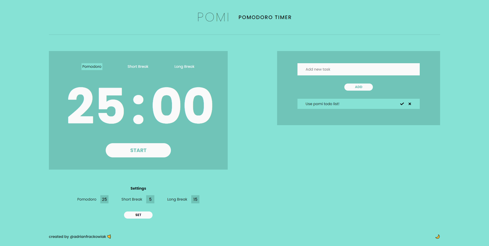

# Pomi - Pomodoro Timer

Pomi is the app used a customizable pomodoro timer. It can help you to stay focus and be more productivity. It's your choice how long you want to study.

## How to use

Pomi is simple to use:
- add tasks to task list
- set pomo time and breaks time
- turn on pomi and study!

🌙 If you want, you can simply change theme to light or dark! ☀️

## Technologies used in Pomi:
- react js
- gatsby
- graphql
- scss
- javascript

LIVE: https://pomi-timer.netlify.app/

